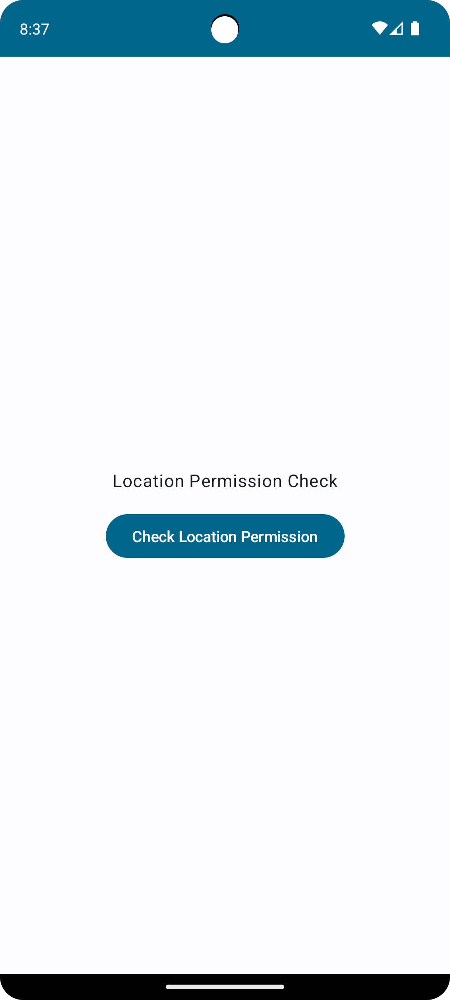
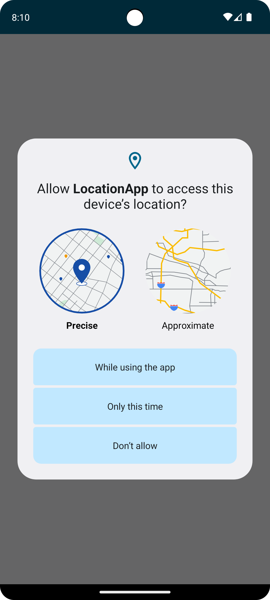
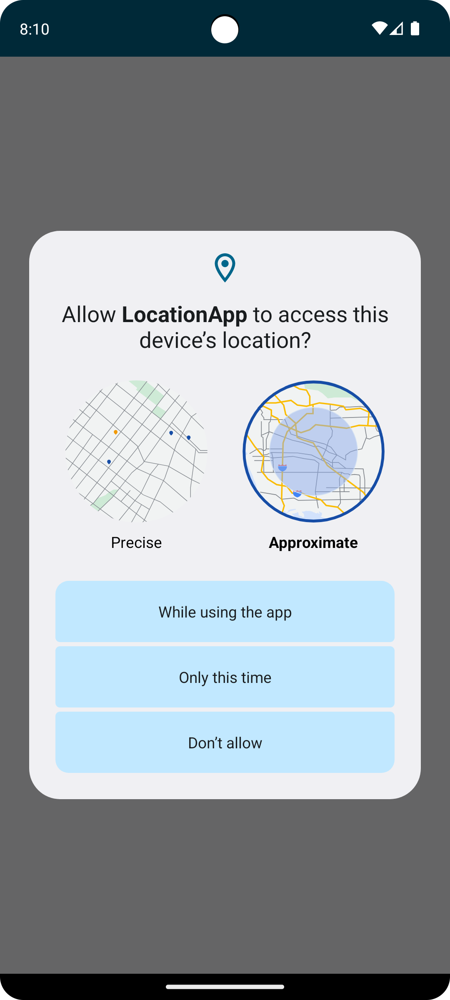
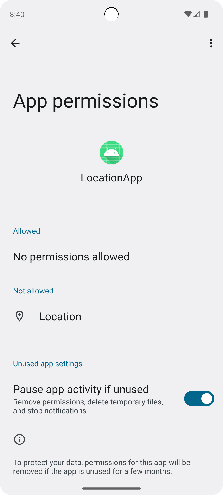
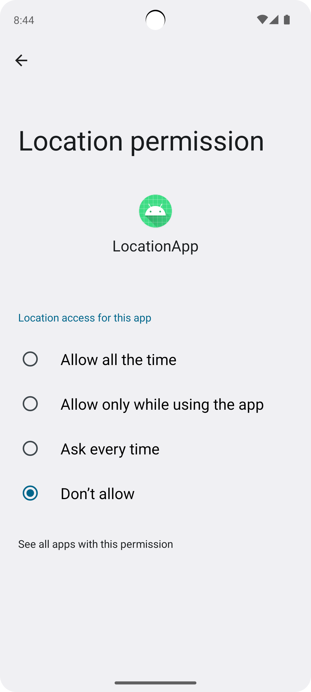
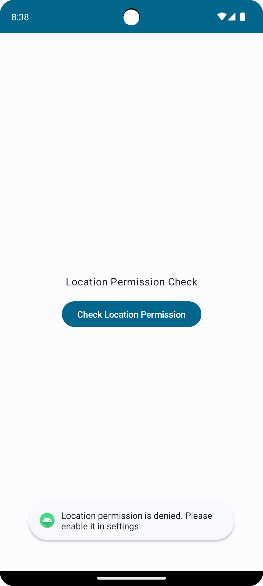
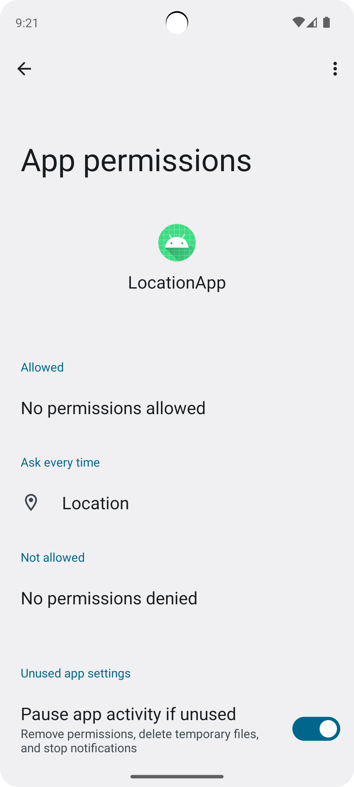
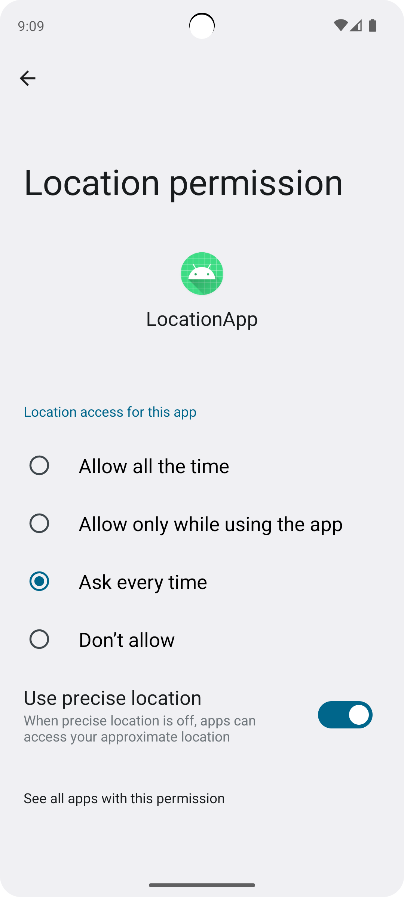
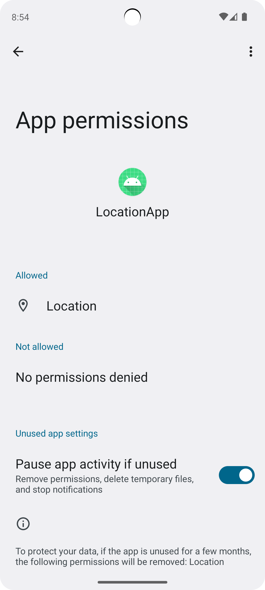

# Yoon's Location-app-Sample

 
 

## Main Activity

    

 
 

## Location Permission

 

### 1. Location Permission choice

    
    

 

### 2. Location Permission denied when location access setting don't allow

    
    
    

 

### 3. Location Permission denied when location access setting ask every time

    
    
    

 

### 4. Location Permission allow

    
    
    

